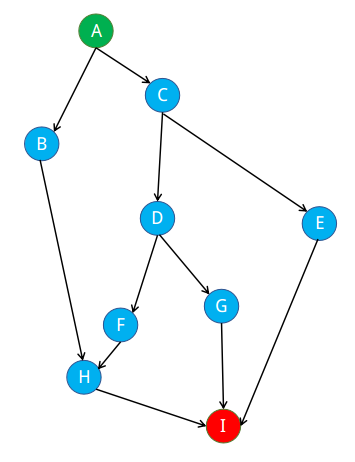

# Penentuan Jalur Terpendek Dengan Algoritma Greedy

## Language

-  

## Tools

- 

## Test coverage

-  python

## Documentation

- Salah satu contoh dari penyelesaian masalah dengan algoritma greedy yaitu mencari jarak terpendek dari peta

    Misalkan kita ingin bergerak dari titik A ke titik I, dan kita telah menemukan beberapa jalur dari peta:

    
    
    Dari peta yang ditampilkan di atas, dapat dilihat bahwa terdapat beberapa jalur dari titik A ke titik I. 
    Sistem peta pada gambar secara otomatis telah memilih jalur terpendek (berwarna biru). 
    Kita akan mencoba mencari jalur terpendek juga, dengan menggunakan algoritma greedy.

- Graph Sederhana dari Titik A ke I

    
    
    Dari gambar di atas, kita dapat melihat bagaimana sebuah peta jalur perjalanan dapat direpresentasikan dengan 
    menggunakan graph, spesifiknya Directed Graph (graph berarah). Maka dari itu, untuk menyelesaikan permasalahan 
    jarak terpendek ini kita akan menggunakan struktur data graph untuk merepresentasikan peta. 
    Berikut adalah graph yang akan digunakan:

- Graph Berarah dari Titik A ke I

    
    
- Graph Berarah Beserta Jarak Masing-Masing Titik dari Titik A ke I

    
    
    Untuk mencari jarak terpendek dari A ke B, sebuah algoritma greedy akan menjalankan langkah-langkah seperti berikut:
    
    
    a. Kunjungi satu titik pada graph, dan ambil seluruh titik yang dapat dikunjungi dari titik sekarang.
    
    
    b. Cari local maximum ke titik selanjutnya.
    
    
    c. Tandai graph sekarang sebagai graph yang telah dikunjungi, dan pindah ke local maximum yang telah ditentukan.
    
    
    d. Kembali ke langkah 1 sampai titik tujuan didapatkan.
    
- ScreenShot 5

    
    
    Dengan menggunakan algoritma greedy pada graph di atas, hasil akhir yang akan didapatkan sebagai jarak terpendek adalah A-C-D-G-I. 
    Hasi jarak terpendek yang didapatkan ini tidak tepat dengan jarak terpendek yang sebenarnya (A-B-H-I). 
    Algoritma greedy memang tidak selamanya memberikan solusi yang optimal, dikarenakan pencarian local maximum pada setiap langkahnya, 
    tanpa memperhatikan solusi secara keseluruhan.
- ScreenShot 6

    

- ScreenShot 7

    
    

## License
> This program is Free Software: 
You can use, study, share and improve it at your will. 
Specifically you can redistribute and/or modify it under the terms of the [GNU General Public License](https://www.gnu.org/licenses/gpl.html) 
as published by the Free Software Foundation, either version 3 of the License, or (at your option) any later version.
